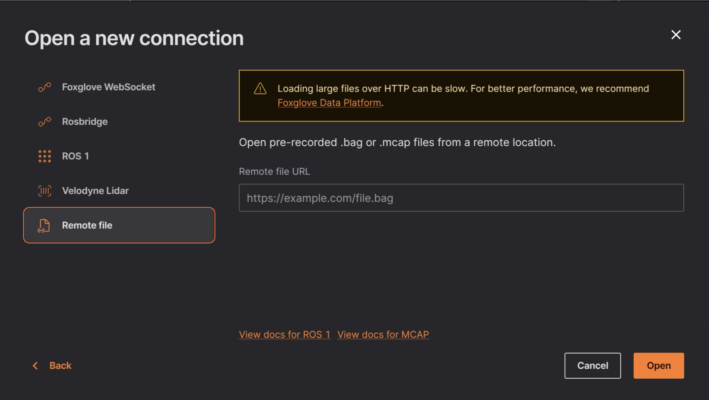

# MCAP

Load local and remote [`.mcap`](https://mcap.dev) files.

## Live Data

In Lichtblick select "Open connection" in the initial pop up or the menu on the top left.   

## Remote File

For this option just select the "Remote file" in the "Open connection" option and enter the URL to your remote `.mcap` file.

Its important to note that the "Remote file" option it's only viable to open a single link to a file.

If you intend to open more than one `.mcap` file via URL you'll need to change the URL manually to include all the files sources, for instance, a link to access multiple files would look something like:

`http://lichtblick.com/?ds=remote-file&ds.url=http%3A%2F%2Flichtblick.dev%2Ftest-file1.mcap&ds.url=http%3A%2F%2Flichtblick.dev%2Ftest-file2.mcap`

The first parameter `ds`, identifies the `datasource` of the files, in this case all remote files and then, every single file will have a `ds.url` identifying it as the source URL to open the file.

Don't forget to [set up CORS](../connecting-to-data/live-data.html#cross-origin-resource-sharing-cors-setup) if you intend to host the files yourself and load them into Lichtblick.

## Local Data 

You can load local files for visualization by: 

* The "Open local file(s)..." in the initial pop up or the menu on the top left;
* By dragging the files from your OS file manager;

**When dealing with mulitple files**, Lichtblick will merge them into a single playback timeline. It's important that they all come from the same data source to avoid potencial data loss or erros during playtime.