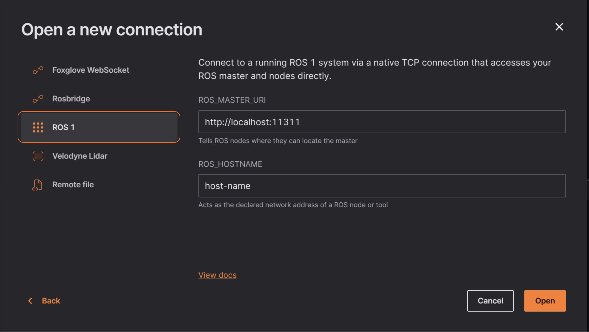

# ROS 1

Load local and remote ROS 1 (`.bag`) files, or connect directly to a live ROS 1 stack.

{{#include ./components/foxglove_note.md}}

## Live data

[Install ROS 1](), and make sure you're connected to the same network as the robot.

Then, in Lichtblick, select ["Open connection"](./introduction.md), either on the initial welcome pop up or via the app bar menu.

## Foxglove WebSocket

Using Foxglove WebSocket will ensure a simple and reliable connection especially if you have a firewall between ROS and Lichtblick. This method requires opening only one port on your ROS host.

To use this option, you'll need to run an additional ROS node (`foxglove_bridge`). Follow the installation instructions [here]().

### Connecting 

After setting up the Foxglove bridge, select "Foxglove WebSocket" in the "Open connection" window, then insert the URL to your Foxglove bridge server.

### Reset Connection

To reconnect to a Foxglove WebSocket in a different context, you must first clear the most recently visualized data in Foxglove.

To reset your visualizations and start a new session, resend the [`serverInfo message`](https://github.com/lichtblick-suite/ws-protocol/blob/main/docs/spec.md#fields) with an updated value for its optional sessionID field (`string`). This signals to the Foxglove WebSocket connection that you are initiating a fresh connection rather than attempting to restore a dropped one.

### Limitations 

Foxglove WebSocket connections allow both publishing data back to your ROS stack and reading or modifying ROS parameters.

## Rosbridge 

For better performance, we recommend using the Foxglove WebSocket connection instead.

 

If you prefer, you can connect Foxglove to your running ROS stack via WebSockets using a Rosbridge connection. This method also requires only a single open port between Foxglove and your robot.

A Rosbridge connection uses a standardized protocol to link Lichtblick with your ROS master over WebSockets. While it does require running an additional ROS node [rosbridge_server](https://wiki.ros.org/rosbridge_server), it is a good option if a network firewall separates ROS and Lichtblick, as it minimizes port exposure.

To open a Rosbridge connectionm, you need to have installed [rosbridge-suite](https://wiki.ros.org/rosbridge_suite):

`$ sudo apt install ros-noetic-rosbridge-suite`

Next, start the WebSocket server, and review the command printout to determine the port it is listening on (e.g. `ws://0.0.0.0:9090`):

`$ roslaunch rosbridge_server rosbridge_websocket.launch`

Finally "Open connection" in the "Open data source" dialog, select "Rosbridge" and then enter the URL to your Rosbridge server:

To test if everything is working well, you can check the topics tab on the left sidebar.

### Limitations
Rosbridge connections support publishing back to your ROS stack, but not reading or setting [ROS parameters](https://github.com/orgs/foxglove/discussions/223).

## Native

Desktop Only

For direct access to your ROS master and nodes, connect using a native TCP (Transmission Control Protocol) connection.

Ensure you have a working [ROS 1 setup](https://foxglove.dev/blog/installing-ros1-noetic-on-ubuntu) and then run `roscore` in your terminal.

Select "ROS 1" in the "Open data source" dialog, and enter your [ROS_MASTER_URI](https://wiki.ros.org/ROS/EnvironmentVariables#ROS_MASTER_URI) (ROS master's IP and port) and [ROS_HOSTNAME](https://wiki.ros.org/ROS/EnvironmentVariables#ROS_IP.2FROS_HOSTNAME):

If you encounter connectivity issues, verify that your ROS stack and Foxglove have unrestricted network access, as ROS communicates over multiple ports.

If ROS and Foxglove are running on different machines, refer to the ROS 1 [Network Setup documentation](https://wiki.ros.org/ROS/NetworkSetup) to properly configure your environment.

## Remote File

For this option just select the "Remote file" in the "Open connection" option and enter the URL to your remote `.bag` file.

Don't forget to [set up CORS](../connecting-to-data/live-data.html#cross-origin-resource-sharing-cors-setup) if you intend to host the files yourself and load them into Lichtblick.

## Local Data 

You can load local files for visualization by: 

* The "Open local file(s)..." in the initial pop up or the menu on the top left;
* By dragging the files from your OS file manager;

